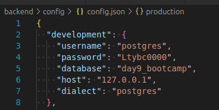

# vacancies-web-app
Web application for searching vacancies

### Сборка и настройка

1.  Для корректной работы, в системе должен быть установлен `Node JS`, `npm` и `postgres` (должен быть запущен)

2.  Находясь в каталоге **ex1** откройте файл `backend/config/config.json` для конфигурации доступа к БД:

    

    В разеделе `"development"` замените **"username"** и **"password"** на те, которые используются для доступа к `postgres` в вашей системе.

3.  Находясь в каталоге **ex1** откройте файл `backend/.env` чтобы сконфигурировать доступ сервера к БД:

    

    Замените **DB_USER** и **"DB_PASSWORD"** на те, которые используются для доступа к `postgres` в вашей системе. При необходимости поменяйте порт, если он отличается от того что в файле.

4.  Перейдите в каталог **`backend`** и запустите команду `npm install` и дождитесь окончания установки пакетов.

    

5.  Командой `npm run-script dbr` создадим БД. База создается с двумя демо-пользователями и несколькими демо-вакансиям

    

6.  Пользователь **celestac** с паролем `celestac` - это обычный пользователь (соискатель). Пользователь **celestac-company** с паролем `celestac-company` - это работодатель. Так же автоматически создаются три вакансии: `Преподователь танцев`, `Ведущий системный администратор` (не активная) и `C++ Developer [Middle/Senior]`. Пользователь **celestac** откликнулся на все три вакансии.

7.  Запустим сервер командой `npm run-script start`:

    

8.  Не закрывая окно запуска сервера, откроем новое (второе) окно консоли. В нем перейдем в каталог **`frontend`** и запустите команду `npm install` и дождитесь окончания установки пакетов (может занять какое то время). PS: Если будут ворнинги - то это не страшно. Связано это с зависимостями пакетов, но для успокоения души можно запустить _(не обязательно)_ `npm audit fix --force`

9.  Командой `npm start` запускаем веб-приложение. (если автоматически не открылась страница в браузере, то перейдете по адресу [адресу](http://localhost:3000/) `localhost:3000/`). А т.к. нет авторизованного пользователя произойдет редирект на страницу `http://localhost:3000/login`

    

### Работа с приложением

1.  Если попытаться вручную ввести адрес любой из страниц приложения, будет происходить редирект на страницу авторизации, которая выгядит так:

    

2.  Можно воспользователься демо-пользователями из п.6 (выше), а можно создать своих пользователей. Для создания пользователя нажмите `Create an account` после чего будет предложен выбор, в качестве кого вы хотите зарегистрироваться.

    

3.  Сначала зарегистриуемся как компания. Нажмите `Employer` и на открвышейся странице введите для создания аккаунта, например:

    

    После создания аккаунта вы увидите всплывающее сообщение и произойдет редирект на страницу входа. Войдите в систему только что созданным аккаунтом.

4.  После авторизации попадаем на страницу вакансий (тут отображаются все вакансии из БД, которые не закрыты):

    

5.  Нажмем пункт меню `Active vacancies` и убедимся, что там все пусто. Т.к. мы еще не создали ни одной вакансии. Перейдем в `Create vacancy` и создадим несколько вакансий (создайте не меньше 3х, чтобы потом далее было удобнее понять остальной функционал):

    

6.  Снова перейдем в `Active vacancies` и увидим только что созданные вакансии. Данный пункт меню показывает все активные (не закрытые) вакансии, созданные текущим пользователем. Цифра 0 в правом углу - говорит о том, что пока на вакансию никто не откликнулся.

    

7.  Теперь нажмем на любую из вакансий и перейдем в нее. Если нажать кнопку `Close vacancy` - то вакансия считается закрытой и больше не будет отображаться в списке активных вакансий.

    

8.  Нажмите `Logout` и зарегистрируйтесь в системе как **соискатель**. Для этого повторите п.2-3, только выбрать тип пользователя нужно `Applicant`
9.  После авториазции как соискатель будет отображен весь список вакансии (активных, т.е. не закрытых), которые есть в БД. Так же отображены две демо-вакансии, которые были созданы при создании БД и все вакансии, которые Вы создали на предыдщих шагах.

    

10. Нажмите на любую из созданных вакансий и подпишитесь на нее (можете конечно же подписаться на все). Чтобы подписаться в карточке вакансии нажмите кнопку `Subscribe` в правом нижнем углу.

    

11. Теперь перейдите в пункт меню `My vacancies` и тут будут отражены все вакансии, на которые вы подписаны.

    

12. Так же можно отменить свой отклик на вакансию. Нажмите на вакансию и в карточке нажмите кнопку `Cancel response`

    

    Подпишитесь на все вакансии (это понадобидтся для дальнейших проверок)

13. Если авторизованному как соискатель пользователю попробовать перейти по прямой ссылки в браузере на создание вакансии `http://localhost:3000/create-vacancy` или `http://localhost:3000/active-vacancies` или сразу на конкретную активную вакансию `http://localhost:3000/active-vacancies/1` то будет происходить редирект на страницу со списком вакансий (что и логично, т.к соискатель не может создавать вакансии)

14. Нажмите `Logout` и войдите в систему как компания (пользователь, которого вы изначально создали). Если вы вдруг забыли логин и пароль, то воспользуйтесь демо пользователем `celestac-company` с таким же паролем. После авторизации перейдите в пункт меню `Active vacancies`, где вы увидите в правом углу вакансии количество подписавшихся на нее пользователей.

    
